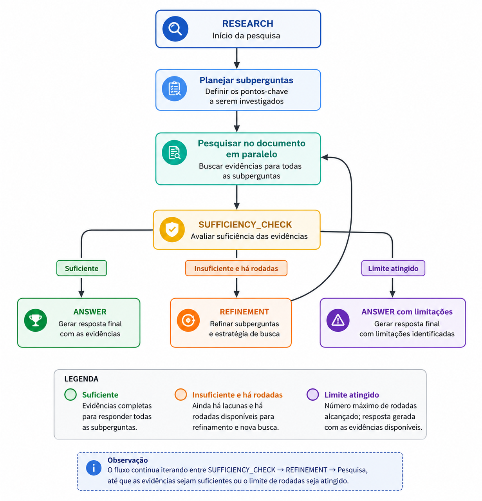
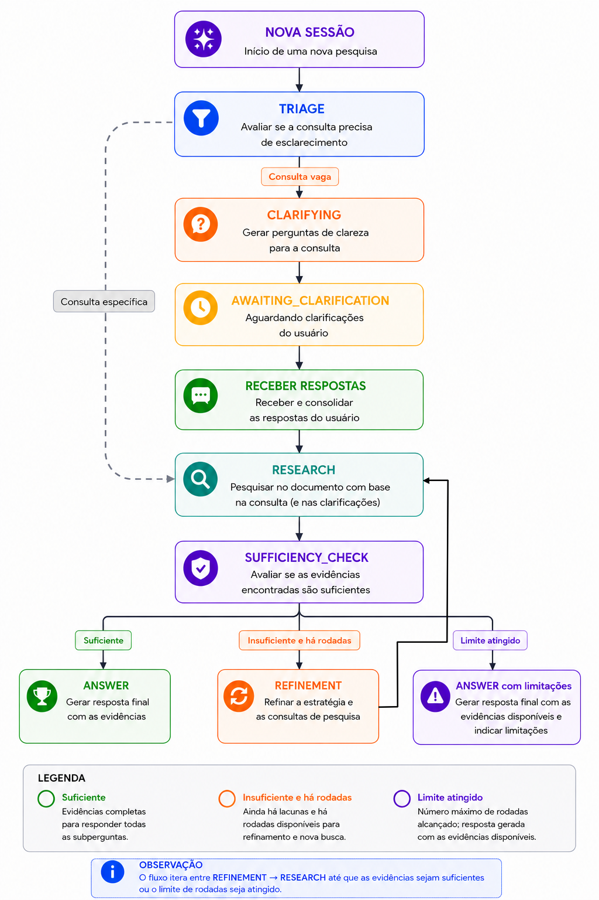

# Fluxos de pesquisa em documentos

### Este projeto oferece dois modos de consulta, ambos baseados exclusivamente no PDF enviado. Não existe busca na web.

### - **Resposta rápida:** uma única recuperação RAG para uma pergunta objetiva.
### - **Pesquisa aprofundada:** planejamento, pesquisas paralelas, avaliação de suficiência, refinamento opcional e redação final.

## 1. Preparação do documento

### Os dois modos dependem primeiro do endpoint `POST /documents`.

### Passo a passo

### 1. `routes.upload_document` valida a extensão `.pdf` e o limite de 20 MB.
### 2. `document_service.prepare_document` coordena o processamento.
### 3. `docling_service.create_chunks` converte o PDF com Docling.
### 4. O `HybridChunker` cria trechos de até 512 tokens, preservando estrutura, páginas e origem.
### 5. `embedding_service` gera os embeddings dos trechos.
### 6. `vectorstore_service.index_chunks` cria uma coleção Chroma isolada.
### 7. A coleção é associada a um `document_id` mantido em memória.
### 8. O endpoint devolve o identificador e métricas do processamento.

### O armazenamento atual não é persistente. Reiniciar a aplicação remove as coleções e invalida os identificadores existentes.

## 2. Resposta rápida

### Endpoint: `POST /questions`

### Use este modo para perguntas objetivas que não precisam de planejamento, refinamento ou relatório extenso.

### Entrada

```json
{
  "document_id": "id-retornado-no-upload",
  "question": "Qual é a principal conclusão do documento?"
}
```

### Passo a passo

### 1. A rota localiza a coleção Chroma pelo `document_id`.
### 2. `rag_service.answer_from_vectorstore` executa busca por similaridade.
### 3. São recuperados até 10 chunks candidatos.
### 4. `rerank_service.rerank_documents` envia os candidatos ao serviço de reranking.
### 5. Os 2 chunks mais relevantes formam o contexto final.
### 6. O LLM recebe somente esse contexto e a pergunta.
### 7. O prompt impede uso de conhecimento externo e exige que informações ausentes sejam declaradas.
### 8. A API devolve a resposta e as páginas utilizadas.

### Saída

```json
{
  "answer": "Resposta baseada no documento.",
  "sources": [
    {
      "page": 3,
      "excerpt": "Trecho utilizado como evidência..."
    }
  ]
}
```

## 3. Pesquisa aprofundada direta

### Endpoint: `POST /research`

### Este endpoint inicia diretamente na etapa `RESEARCH`. Ele não executa triagem nem pode pausar para receber esclarecimentos.

### Entrada

```json
{
  "document_id": "id-retornado-no-upload",
  "question": "Analise benefícios, riscos e limitações da proposta.",
  "depth": 2
}
```

###  `depth` aceita valores de 1 a 3 e limita o total de rodadas de pesquisa. A pesquisa inicial conta como uma rodada; cada refinamento executado conta como outra.

### Fluxo



## 3.1 Planejamento

### 1. `planner_agent.create_search_plan` recebe a pergunta principal.
### 2. O agente gera até 4 subperguntas independentes.
### 3. Cada item contém `query` e `reason`.
### 4. A pergunta original é sempre pesquisada exatamente como em `/questions`; as subperguntas apenas ampliam a cobertura.
### 5. Se o planejador falhar, a pergunta original é usada como consulta única.

## 3.2 Research

### 1. `search_agent.execute_searches` executa as consultas paralelamente.
### 2. Cada consulta usa o mesmo RAG da resposta rápida.
### 3. Cada resultado gera um `ResearchFinding` com resposta, fontes e quantidade de evidências.
### 4. Uma falha isolada vira um finding com `error`; as demais consultas continuam.

## 3.3 Sufficiency check

### 1. `sufficiency_agent.check_research_sufficiency` recebe a pergunta e todos os findings acumulados.
### 2. O agente verifica cobertura, presença de fontes, erros e conclusões genéricas.
### 3. O resultado estruturado contém:
###    - `is_sufficient`;
###    - `reason`;
###    - `missing_information`, com até 4 lacunas pesquisáveis.
### 4. Se for suficiente, o fluxo segue para `ANSWER`.
### 5. Se for insuficiente e ainda houver rodadas, segue para `REFINEMENT`.
### 6. Se a profundidade máxima tiver sido atingida, segue para `ANSWER`, preservando o diagnóstico de insuficiência.

## 3.4 Refinement

### 1. `refinement_agent.create_refinement_plan` recebe a pergunta, os findings e as lacunas.
### 2. O agente cria até 4 consultas complementares.
### 3. Consultas já executadas ou duplicadas são removidas.
### 4. As consultas resultantes voltam para `RESEARCH`.
### 5. Se o refinamento não produzir consultas novas, o ciclo termina para evitar repetição infinita.

## 3.5 Answer

### 1. `writer_agent.write_report` recebe todos os findings e o último resultado de suficiência.
### 2. Somente findings com fontes podem sustentar conclusões.
### 3. As páginas são incluídas no texto final.
### 4. Quando a pesquisa continua insuficiente, o relatório declara as limitações e não apresenta lacunas como fatos.
### 5. A resposta também inclui findings, revisão, fontes deduplicadas, total de rodadas e `sufficiency_check`.

## 4. Pesquisa aprofundada com triagem e esclarecimento

### Endpoint inicial: `POST /research/sessions`

### Este é o fluxo completo:

### `TRIAGE → CLARIFYING (opcional) → RESEARCH → SUFFICIENCY_CHECK → REFINEMENT (opcional) → ANSWER`



## 4.1 Triage

### 1. `triage_agent.check_needs_clarification` avalia objetivo, escopo e critérios.
### 2. Perguntas factuais ou específicas seguem diretamente para pesquisa.
### 3. Consultas ambíguas seguem para o agente de esclarecimento.
### 4. Se a triagem falhar, o sistema continua diretamente para pesquisa.

## 4.2 Clarifying

### 1. `clarifying_agent.generate_clarification_questions` gera de 1 a 3 perguntas necessárias.
### 2. A sessão muda para `awaiting_clarification`.
### 3. A resposta da sessão contém `clarification_questions` e `clarification_responses`.
### 4. O cliente responde uma pergunta por chamada:

```http
POST /research/sessions/{session_id}/clarifications
Content-Type: application/json

{
  "answer": "Priorize riscos técnicos e impactos operacionais."
}
```

### 5. Enquanto houver perguntas pendentes, a sessão permanece aguardando.
### 6. Após a última resposta, pergunta original e esclarecimentos são combinados.
### 7. A pesquisa aprofundada começa automaticamente.

### O índice da pergunta atual corresponde à quantidade de itens já existentes em `clarification_responses`.

## 4.3 Estados da sessão

| Estado | Significado |
|---|---|
| `pending` | Sessão criada, antes da decisão de triagem |
| `awaiting_clarification` | Aguardando uma ou mais respostas do usuário |
| `researching` | Pesquisa e possíveis refinamentos em execução |
| `completed` | Relatório final disponível em `report_data` |

### O estado pode ser consultado por `GET /research/sessions/{session_id}`.

## 5. Fallbacks e resiliência

| Etapa | Comportamento quando falha |
|---|---|
| TRIAGE | Prossegue diretamente para pesquisa |
| CLARIFYING | Usa três perguntas padrão |
| Planejamento | Pesquisa a pergunta principal |
| Pesquisa individual | Registra finding com erro e continua as outras |
| SUFFICIENCY_CHECK | Usa verificação determinística baseada em fontes e erros |
| REFINEMENT | Cria consultas a partir de `missing_information` |
| ANSWER | Concatena os achados suportados e declara limitações |

## 6. Responsabilidades dos arquivos

| Arquivo | Responsabilidade |
|---|---|
| `api.py` | Entrypoint para `uvicorn api:app` |
| `deep_research/app.py` | Criação e configuração do FastAPI |
| `deep_research/routes.py` | Contratos HTTP e endpoints |
| `deep_research/models.py` | Modelos Pydantic do fluxo |
| `deep_research/research_manager.py` | Orquestração e estado das sessões |
| `deep_research/agents/triage_agent.py` | Decisão sobre esclarecimento |
| `deep_research/agents/clarifying_agent.py` | Perguntas de esclarecimento |
| `deep_research/agents/planner_agent.py` | Plano inicial de pesquisa |
| `deep_research/agents/search_agent.py` | Execução paralela das consultas |
| `deep_research/agents/sufficiency_agent.py` | Avaliação das evidências acumuladas |
| `deep_research/agents/refinement_agent.py` | Plano de busca complementar |
| `deep_research/agents/writer_agent.py` | Revisão e resposta final |
| `deep_research/services/document_service.py` | Preparação e indexação do PDF |
| `deep_research/services/docling_service.py` | Conversão, chunks e tokens |
| `deep_research/services/embedding_service.py` | Embeddings externos |
| `deep_research/services/vectorstore_service.py` | Coleções Chroma em memória |
| `deep_research/services/rerank_service.py` | Reranking dos chunks candidatos |
| `deep_research/services/rag_service.py` | Recuperação e resposta baseada no contexto |
| `deep_research/services/llm_service.py` | Configuração e cache do LLM |

## 7. Escolha do modo

## Use `POST /questions` quando:

### - a pergunta é objetiva;
### - uma única busca é suficiente;
### - a menor latência é prioritária.

## Use `POST /research` quando:

### - a consulta já está bem definida;
### - é necessário investigar múltiplos aspectos;
### - não haverá interação para esclarecimento.

## Use `POST /research/sessions` quando:

### - a consulta pode estar vaga;
### - o sistema deve confirmar escopo e critérios;
### - é necessário executar o fluxo adaptativo completo.
